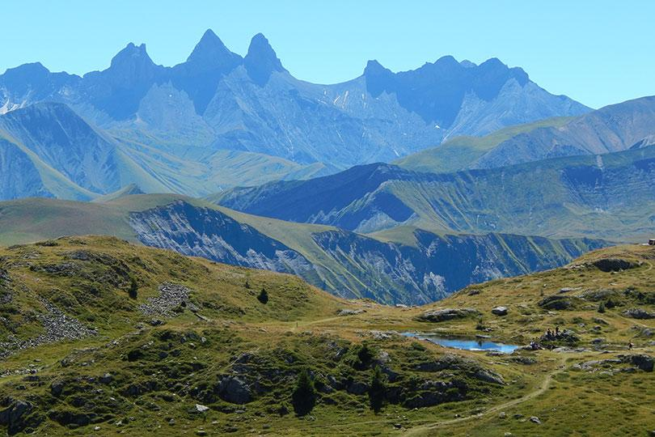
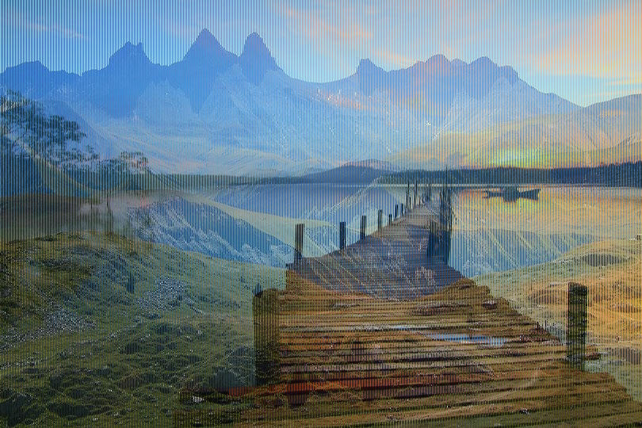

# Exercice in rust

A simple image combiner in rust.

## Usage

```sh
cargo run ./images/your_image_1.jpg ./images/your_image_2.jpg images/output.jpg
```

## Exemple

### `image_1.jpg`



### `image_2.jpg`


### `output.jpg`

